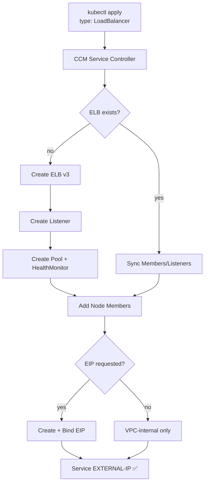
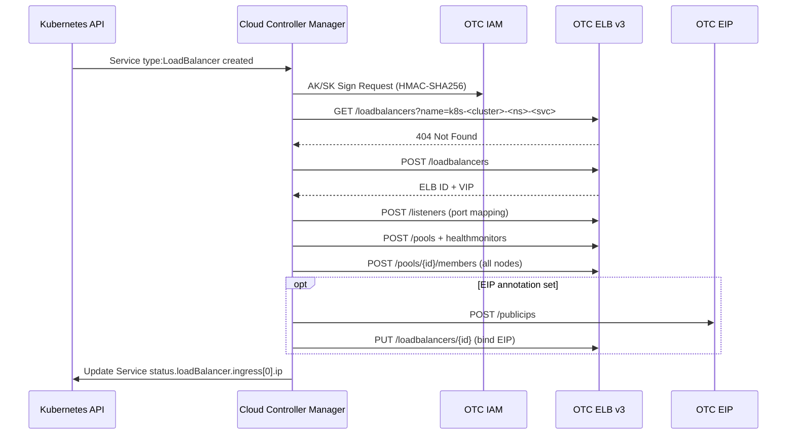

# Kubernetes Cloud Provider for Open Telekom Cloud

The Open Telekom Cloud Controller Manager provides the interface between a Kubernetes cluster and Open Telekom Cloud service APIs.

> **This branch (`feat/loadbalancer-elb-v3`)** adds a full `LoadBalancer` implementation using OTC ELB v3.
> See [PR #17](https://github.com/opentelekomcloud/cloud-provider-opentelekomcloud/pull/17) for the upstream contribution.

## Architecture



## LoadBalancer Flow



## Quick Start

### 1. Deploy the CCM

```bash
helm upgrade --install swiss-otc-ccm \
  oci://ghcr.io/wolfslight-forgehouse/charts/swiss-otc-cloud-controller-manager \
  -n kube-system \
  --set cloudConfig.auth.accessKey=YOUR_AK \
  --set cloudConfig.auth.secretKey=YOUR_SK \
  --set cloudConfig.auth.projectId=YOUR_PROJECT_ID \
  --set cloudConfig.region=eu-ch2 \
  --set cloudConfig.network.subnetId=YOUR_SUBNET_ID
```

### 2. Create a LoadBalancer Service

```yaml
apiVersion: v1
kind: Service
metadata:
  name: my-app
  annotations:
    # Required: subnet for ELB VIP
    otc.io/elb-virsubnet-id: "<neutron-subnet-id>"
    # Optional: attach public EIP
    otc.io/elb-eip-type: "5_bgp"
    otc.io/elb-eip-bandwidth-size: "10"
    otc.io/elb-eip-charge-mode: "traffic"
spec:
  type: LoadBalancer
  selector:
    app: my-app
  ports:
    - port: 80
      targetPort: 8080
```

### 3. Watch the ELB being provisioned

```bash
kubectl get svc my-app -w
# NAME     TYPE           EXTERNAL-IP      PORT(S)
# my-app   LoadBalancer   185.153.x.x      80:30xxx/TCP
```

## Annotations Reference

| Annotation | Required | Description |
|---|---|---|
| `otc.io/elb-virsubnet-id` | ✅ | Neutron subnet ID for ELB VIP |
| `otc.io/elb-eip-type` | — | EIP type (e.g. `5_bgp`) — triggers EIP creation |
| `otc.io/elb-eip-bandwidth-name` | — | EIP bandwidth resource name |
| `otc.io/elb-eip-bandwidth-size` | — | Bandwidth in Mbps (default: 10) |
| `otc.io/elb-eip-charge-mode` | — | `traffic` or `bandwidth` |
| `kubernetes.io/elb.id` | — | Use a pre-existing shared ELB |

## Supported OTC Regions

| Region | Status | IAM Endpoint |
|---|---|---|
| `eu-ch2` (Swiss OTC) | ✅ Tested | `iam-pub.eu-ch2.sc.otc.t-systems.com` |
| `eu-de` (OTC Germany) | 🔄 Compatible | `iam.eu-de.otc.t-systems.com` |

## Package Structure

```
pkg/opentelekomcloud/
├── config/
│   └── config.go           # Cloud config (YAML), AK/SK + Password auth
├── loadbalancer/
│   ├── loadbalancer.go     # cloudprovider.LoadBalancer interface
│   ├── client.go           # ELB v3 REST client + AK/SK signer
│   ├── aksk_signer.go      # HMAC-SHA256 request signing
│   ├── loadbalancer_test.go
│   └── mock_test.go        # Offline ELB v3 mock (no OTC account needed)
└── opentelekomcloud.go     # CloudProvider wiring
```

## Compatibility

| Kubernetes | CCM | OTC ELB API | Go |
|---|---|---|---|
| v1.34+ | this branch | v3 (Dedicated ELB) | 1.25 |
| v1.31+ | v0.1.0 (upstream) | — | — |

## Building

```bash
make build    # binary → bin/cloud-provider-opentelekomcloud
make test     # all unit tests (offline, no OTC needed)
make lint     # golangci-lint
make vet      # go vet
```

## Contributing

See [CONTRIBUTING.md](.github/CONTRIBUTING.md).
